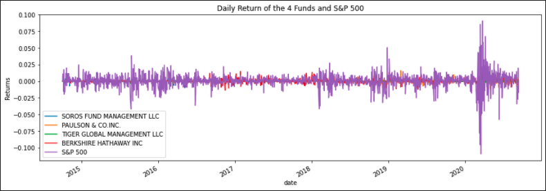
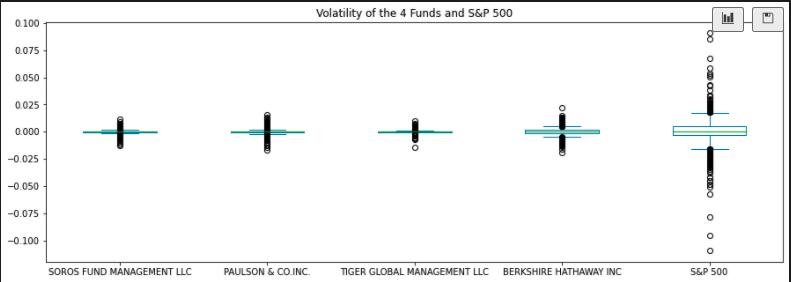

# Whale_RiskReturn_Analysis
Portfolio Risk Return Analysis 

This notebook is using algorithms to build each client's portfolio, from various investment styles and options. We will be valuating four new investment options for inclusion in the client portfolio to determine the fund with the most investment potential based on key risk-management metrics: the daily returns, standard deviations, Sharpe ratios, and betas.

Please be sure to install all the prerequisites (libraries) before running the program:

- pip install pandas
- pip install numpy

The other libraries, **pathlib** should be installed by default. Also make sure to add the inline matplotlib as is ```%matplotlib inline```.

After completing the prereq run the [risk_return_analysis.ipynb](risk_return_analysis.ipynb) notebook.

This notebook is running a lot of analysis; see  below as examples:






----
@jojomani - by Johann Maiga